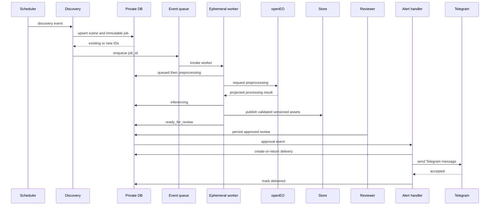
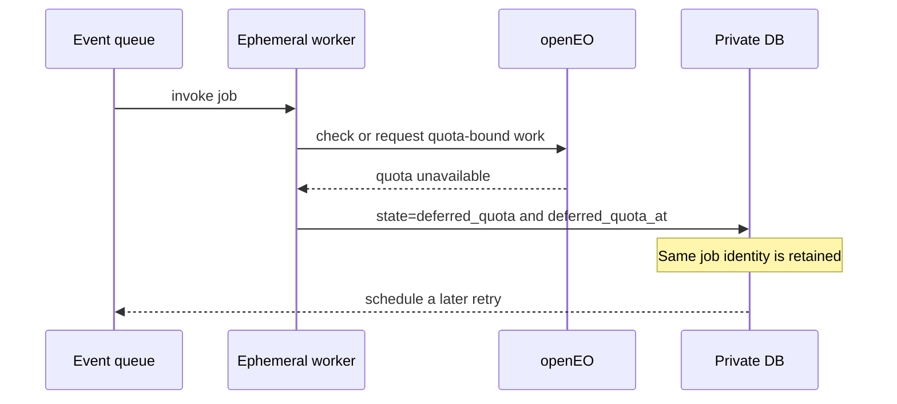
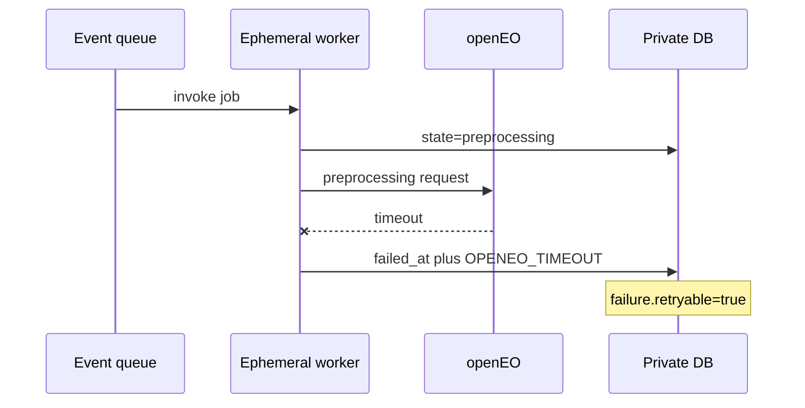
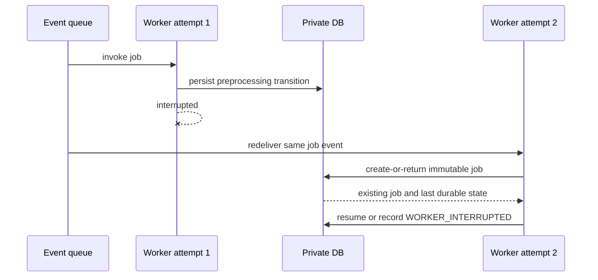
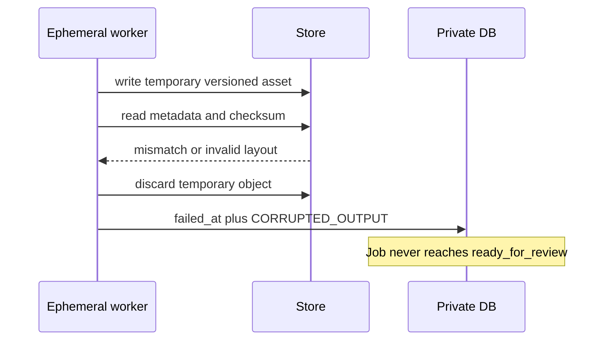
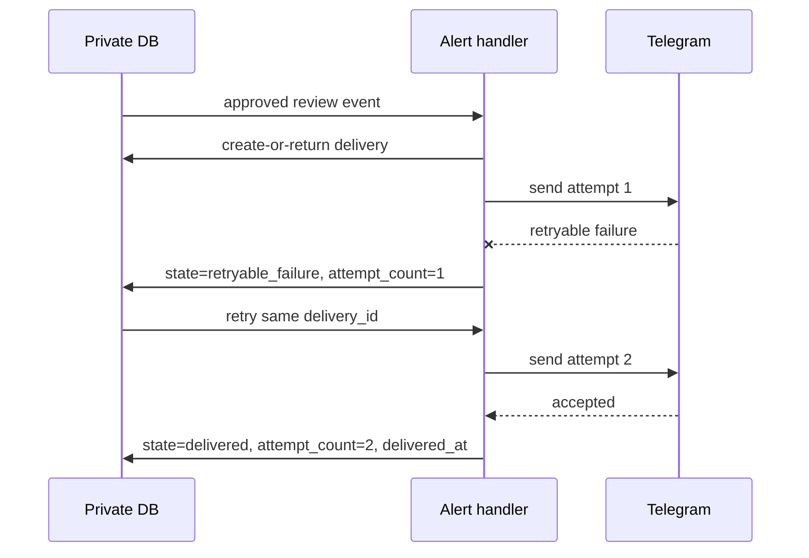

# Part 5 event sequences

These diagrams describe contract behavior, not deployed services. `DB` means the
private metadata schema and `Store` means private object storage.

## Success



## Quota deferral



## openEO timeout



## Worker interruption



## Corrupted output



## Review conflict

```mermaid
sequenceDiagram
    participant R1 as Reviewer 1
    participant R2 as Reviewer 2
    participant DB as Private DB
    R1->>DB: submit revision 2 from revision 1
    DB-->>R1: review saved
    R2->>DB: submit revision 2 from revision 1
    DB-->>R2: conflict; current revision is 2
    R2->>DB: reload candidate and review history
    Note over DB: No alert event for rejected conflict
```

## Telegram retry


